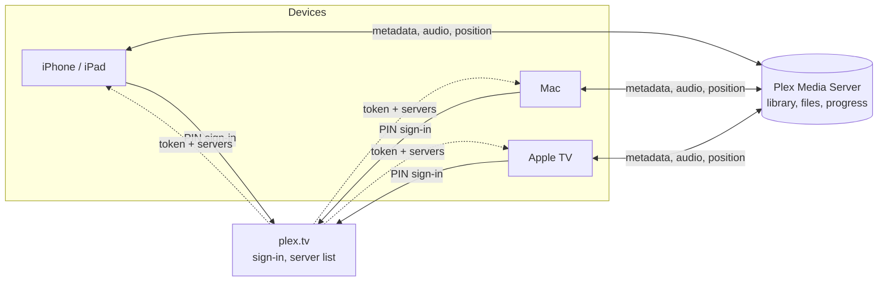
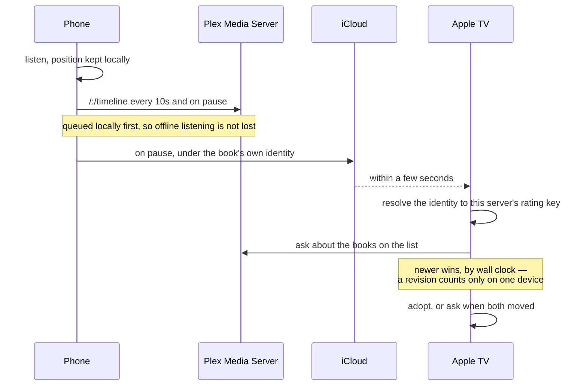

<p align="center">
  
</p>

<h1 align="center">VocalisBook</h1>

<p align="center">
  A third-party audiobook player for Plex Media Server — iPhone, Mac and Apple TV.
</p>

---

Plex stores audiobooks in a music library, so Plex's own apps show them as albums
of tracks. That works until you actually listen to one: your place is kept per
file rather than per book, chapters are whatever the files happen to be, and
speed, bookmarks and a sleep timer are either missing or in the way.

VocalisBook puts a book-shaped layer over that music-shaped data. It talks to your
server directly, keeps your position in step across devices, and behaves like an
audiobook player on each platform rather than one design squeezed onto three.

It is an independent third-party client. Not affiliated with, endorsed by, or
associated with Plex Inc. "Plex" is a trademark of Plex Inc.

## How it fits together

The app is a client. Plex holds the files and the coarse progress; everything the
app knows beyond that lives on the device.



Sign-in happens once, against plex.tv, and returns a token and the list of
servers the account can see. Everything after that talks to the server directly —
local address first, then a direct one, then Plex's relay, whichever answers.
Audio is direct play; nothing is transcoded.

## How your place gets from one device to another

Two destinations, and they answer different questions. **Plex** holds the
position within each file, which is what every other Plex client reads.
**iCloud** holds the listening state: which books are on the go, where you are in
them, whether they are finished, your bookmarks, your history and your per-book
speed. Plex has no third-party user data API, so the second list has nowhere else
to go.



A position is written locally before it is sent, so listening with no connection
is never lost — it goes out when there is one. When both sides have moved since
they last agreed, the app asks rather than guessing: silently picking one loses
the other, and that is the failure an audiobook player is least forgiven for.

**A book travels under its own identity, not its rating key.** A rating key is a
row number in one server's database, so the same audiobook on a second server is
a different number — and progress keyed on it would not follow. Where the
[SpokenMeta](https://github.com/kladhest-se/SpokenMeta) agent has matched a book,
its Audible or LibriVox identity is what iCloud records, and the same book is the
same book anywhere. Books nothing has matched fall back to server-plus-rating-key,
which is honest about how far it can travel.

## What it does

**Your place, kept per book.** Everything above the timeline layer counts in
milliseconds from the start of the book, so a single-file m4b and a ninety-file
MP3 rip behave identically. Positions go back to Plex, so finishing a chapter on
the phone and picking it up on the Mac works.

**Next in series.** A book's screen shows what follows it, from the position the
metadata agent recorded — and where it sits, as "Book 6 of 9 in your library". The
count is of what your library holds, because that is all a client can honestly
know: the agent does not know how long a series is. For a library no agent has
matched, Plex collections supply the order instead. Finishing book thirty-two
should not be a dead end.

**Browse by series.** Every series in the library, with its books in reading
order — including the novellas numbered 3.5, which sort where they belong rather
than being rounded away.

**Browse by genre.** Plex tags books with genres once an agent has matched them,
and the app kept none of it. A book has several, so they live in a table of their
own — Fantasy and Humour and Adventure are not a column.

**Chapters, from wherever they exist.** Plex's own chapter data when the server
has analysed the file, chapters embedded in the file when it has not, and file
boundaries as a last resort. Skip by chapter, jump from a list, or set the sleep
timer to end of chapter.

**Speed, remembered per book.** 0.75× to 3×. A dense non-fiction title and a
novel do not want the same speed, and the app should not make you set it twice.

**Sleep timer** that fades rather than cutting, with an end-of-chapter option.

**Bookmarks** — labelled positions you can get back to, and they follow the book
between your devices. On iPhone and Mac; not on Apple TV, for the reason below.

**Offline downloads** on iPhone and Mac. Background transfers survive the app
being suspended, and playback prefers a downloaded file over the stream without
being told which it got. Downloads wait for Wi-Fi unless you say otherwise — the
system holds them rather than failing them. Settings lists what is on the device, with sizes and a
way to remove them individually or all at once.

**Offline mode**, a switch beside the account button. The whole library — books,
authors, collections, search, continue listening — narrows to what is fully
downloaded, and the app stops contacting the server: no refresh, no progress
push, no dashboard heartbeat. Meant for a plane, and for the ordinary case of
wanting to see only what will actually play. A partly downloaded book is treated
as not downloaded, because one that stops at chapter nine is worse than one that
was never listed. Covers are cached on disk, so an offline library looks like a
library rather than a grid of grey squares.

**Listening history.** Sessions are recorded locally, since Plex has no concept
of one. Totals are wall clock, so an hour at 1.5× counts as an hour, and a streak
breaks only after a whole day with nothing in it.

**Stop, as well as pause.** A pause holds the book and leaves a session open on
your Plex server; stopping ends it. Your place is written either way, so stopping
is not abandoning.

**Starting over.** Settings can remove everything cached on a device — the
library, downloads and listening state — and fetch it again from Plex, and from
iCloud where you sync. For when something local has gone wrong and the shortest
way out is to have neither.

**Themes.** Twelve, shared across all three clients: Cream, Sand, Ember, Ink,
Slate, Forest, Plum and Nocturne, plus all four Catppuccin flavours — Latte,
Frappé, Macchiato and Mocha, taken from the published palette rather than
approximated. Nocturne is built for a dark bedroom — near-black, warm dim text,
no blue — and can switch in automatically after dark.

**AirPlay** on iPhone and Mac, from a button in the player. The audio session
uses the long-form audio policy, which puts a book in the AirPlay 2 *audio* group
rather than mirroring a screen — so a HomePod keeps playing after you leave the
app. The iPhone player also names the route it is sending to. The Apple TV has no
picker because the system owns that choice there.

**Where the system expects it.** Lock Screen and Control Centre on iOS, Now
Playing and a menu bar item on macOS, Control Centre on the Apple TV. Hardware
media keys, headphone controls and the Siri Remote all work, with skip intervals
matching the app's own. A book being listened to appears in your Plex server
dashboard like any other client.

## Running it on hardware

`run` is a simulator and `install` is a device. The simulator verbs speak to
`simctl`, which only knows about simulators; a build that succeeds there is not a
build that can run on a phone, because the SDK differs, the app has to be signed,
and installing goes through `devicectl`.

```bash
make devices                          # attached iPhones, iPads and Apple TVs
make teams                            # signing teams this Mac can use

make ios-run                          # on a simulator, logs in this terminal
make ipados-run
make tvos-run

make ios-install    DEVICE=FA371128-… TEAM_ID=ABCDE12345
make ipados-install DEVICE=… TEAM_ID=…
make tvos-install   DEVICE=… TEAM_ID=…
```

The first build for a new Mac, phone or Apple TV registers it with your
account.

The team id is found rather than asked for: a signing certificate carries it in
its subject, so if Xcode has ever set this Mac up for development the answer is
already in the keychain. `TEAM_ID=` still wins if you pass it, which matters if
you belong to more than one team.

There is no team id in `Config/`, deliberately: it is personal, it does not
belong in a repository, and hardcoding one makes the project uncloneable by
anybody else. A free Apple ID works; its profiles expire after seven days, which
is fine for a client you rebuild anyway and worth knowing before it stops
launching on a Tuesday.

No macOS equivalent — the Mac app runs on the machine that builds it, so
`make macos-run` is already the device case.

Archiving for the App Store has its own verb rather than going through Xcode's
Product ▸ Archive directly. Each port's `xcconfig` carries a build number of `1`
as a deliberate, implausible sentinel — the fallback for an archive started
outside `make` — and Xcode's own Archive action has no way to override it.
`make ios-archive` bumps the real counter the same way every other build verb
does and passes it straight to `xcodebuild archive`, opening the result in
Organizer for Validate and Distribute exactly as before.

## Each platform in its own shape

**iPhone and iPad** — a library grid with Continue Listening, a mini player above
the tab bar, and a full player sheet. On an iPad it is the same
structure and the same arrangement — the tab bar stays at the bottom, drawn by
the app because iPadOS puts a `TabView`'s across the top and offers no way to
move it — with larger metrics — six to eight covers per row rather than a dozen
small ones, wider tiles in Home's rows, and the featured card capped rather than
stretched. Not a split view: Home is content, and content in a sidebar is a
screen squeezed into a column beside an empty pane. The player turns on its side
when the screen is wider than it is tall — landscape on a
phone, either orientation on an iPad — with the cover beside the controls rather
than above them. Five tabs — Home, Browse, Authors, Series and Genres — five ways
of looking at the same library, and what of it is on the phone. Collections is
not one of them for now — deferred rather than built halfway, and may return in
a later release. A toggle beside search in Browse narrows the grid to what is
already on the device, independent of offline mode; managing what is
downloaded — sizes, removing things, watching a transfer — is a level inside
Settings, next to the total it reports. Settings, the account and the
offline switch are in the toolbar, on every tab: five tabs is also what keeps
iOS from bucketing anything into its own system-drawn "More" screen, which the
app's theme cannot reach.

**Mac** — the same six sections as the other platforms, as sidebar rows rather
than tabs, plus Downloads and History, with the transport docked at the bottom of
the window. Refresh, offline mode and the account sit beside the search
field, and are in the View and app menus too, with ⌘R and ⇧⌘O rather than hidden in a sheet. Below 620pt wide the window becomes a
compact player instead of a library; the layout follows the window size, so there
is no mode to remember. The app stays in the menu bar when you close the window,
which is the ordinary case while a book is playing.

**Apple TV** — a focus-driven grid and a full-screen player, because a television
shows one thing at a time. It searches, which is not the obvious choice on a
device with a remote: typing is miserable, and scrolling past nine hundred books
with a thumb pad is worse. History is a tab rather than something you navigate
to: tvOS collapses the tab bar whenever a screen is pushed, so anything worth
coming back to belongs in the bar rather than behind it. Sign-in puts the PIN on screen at 88pt, to be read
across a room and typed on your phone.

The Apple TV gives apps no durable local storage, so downloads and bookmarks
cannot work there. They are deliberately absent rather than half-built; that port
streams.

## Requirements

| | |
|---|---|
| iOS | 17+ |
| macOS | 14+, Apple Silicon only |
| tvOS | 17+ |
| Server | Plex Media Server with an audiobook library |

On Plex, an audiobook library is a **music** library: the author is the artist,
the book is the album, and a chapter or file is a track.

Sign-in is Plex's own PIN flow. On iPhone and Mac the authorisation page opens in
`ASWebAuthenticationSession`, which runs out of process — this app never sees
your password. Playback is direct play only; nothing is ever transcoded.

## Building

    brew install xcodegen

    make build             compile everything — boots nothing, signs nothing
    make test              every test that can run without a device

    make ios-run           build, install and launch on an iPhone simulator
    make ipados-run        the same app, on an iPad simulator
    make macos-run         the Mac app
    make tvos-run          the Apple TV app

    make ios-open          generate and open the project in Xcode
                           also ipados-open, macos-open, tvos-open, core-open

    make ios-archive       archive, signed, with a real build number
                           also macos-archive, tvos-archive

    make help              everything else

Three verbs exist for each platform — `-build`, `-test`, `-run` — so a habit from
one carries to the others. On real hardware:

    make devices                          attached iPhones, iPads and Apple TVs
    make ios-install DEVICE=…         build signed, install on hardware
    make ipados-install DEVICE=…
    make tvos-install DEVICE=…

The signing team is found in your keychain if Xcode has ever set this Mac up for
development; `TEAM_ID=` overrides it. A free Apple ID works — its profiles expire
after seven days.

`make ios-run SIM='iPhone 17 Pro'` picks a specific
simulator; without it the newest installed one is used, chosen by udid rather
than by name — by name is ambiguous the moment two runtimes are installed, since
the same phone then exists twice.

`make core` builds Core and `Platform/Shared` for the host and runs their tests
with no simulator at all, which is much the faster answer when what you broke is
not in the app layer. `make platforms` handles the three platform packages, which
cannot all be built that way: each declares one platform and `swift build` always
targets the host.

Xcode projects are generated by XcodeGen from each app's `project.yml` and are
not committed. Edit the `project.yml`, never the `.xcodeproj`.

## Metadata

Built against [SpokenMeta](https://github.com/kladhest-se/SpokenMeta) and its
Client Identity Contract v1 (`CLIENT_INTEGRATION.md` in that repository).

Plex's music schema has nowhere to put a narrator, a co-author, a series
position or an edition, so that agent documents where it puts them instead —
`Style` for narrators, namespaced `Mood` values for the rest — and where a book's
durable identity lives, in the album GUID.

That identity is why progress follows a book rather than a server. All six of
the contract's published test vectors are covered by tests in
`Core/PlexKit/Tests`.

A library matched by another agent, or by none, still works: everything above
degrades to what Plex itself provides, and the per-server fallback identity
carries progress exactly as far as it can honestly go.

## Layout

    Core/PlexKit        Plex API client — knows nothing about audiobooks
    Core/Audiobooks     domain model, timeline, local store, sync
    Platform/Shared     platform-agnostic helpers
    Platform/iOS        per-platform services: playback, storage, sign-in
    Platform/macOS
    Platform/tvOS
    Apps/iOS            app targets
    Apps/macOS
    Apps/tvOS
    Config/             xcconfig build settings

Dependencies point downward only. `Core/PlexKit` has no audiobook concepts and no
platform frameworks, which is why its tests run with no simulator and no server.
Feature code branches on `PlatformCapabilities` rather than `#if os(...)`, so a
screen that is wrong for a platform fails to compile there instead of shipping as
a dead button.

## Where this lives

    git@github.com:kladhest-se/vocalisbook.git

Published by a script rather than pushed by hand: each run commits to whichever
history it cloned, so pushing from two places by hand leaves each side holding a
commit the other has never seen.
