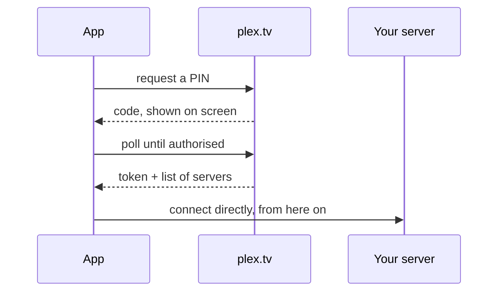
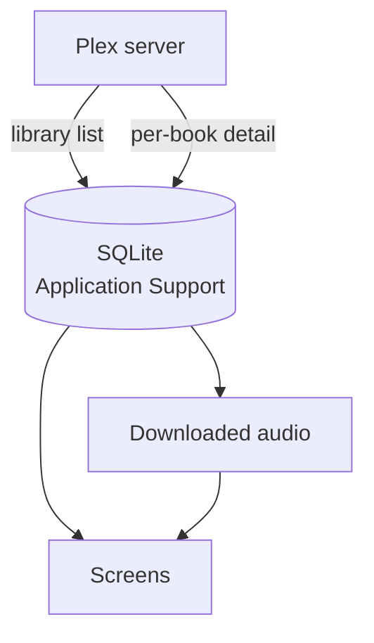
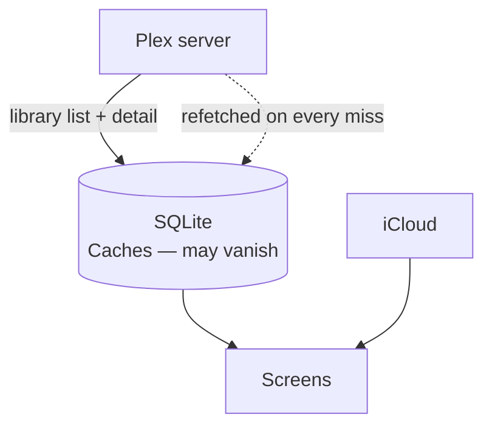
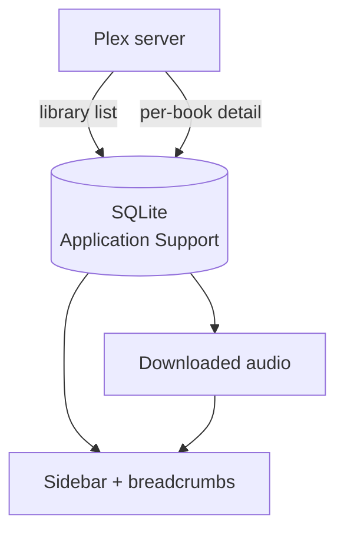
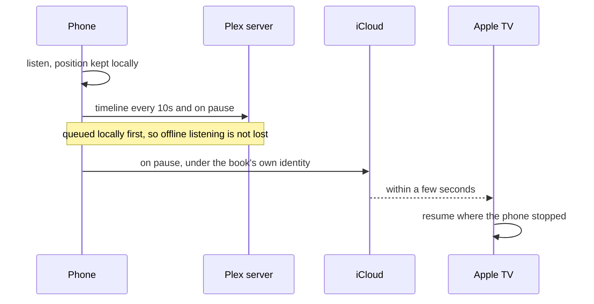

  

<h1 align="center">VocalisBook</h1>

  A third-party audiobook player for Plex Media Server — iPhone, iPad, Mac and Apple TV.

  <a href="https://vocalisbook.kladhest.se">vocalisbook.kladhest.se</a>

---

Plex stores audiobooks in a music library, so Plex's own apps show them as albums
of tracks: your place is kept per file rather than per book, chapters are whatever
the files happen to be, and speed, bookmarks and a sleep timer are missing or in
the way.

VocalisBook puts a book-shaped layer over that music-shaped data. It talks to your
server directly, keeps your place in step across devices, and behaves like an
audiobook player on each platform rather than one design squeezed onto three.

Independent and third-party. Not affiliated with, endorsed by, or associated with
Plex Inc. "Plex" is a trademark of Plex Inc.

## You also need VocalisMeta

Plex's music schema has nowhere to put a narrator, a co-author, a series
position, a language or an edition. There is no field for any of them, so no
Plex agent can supply them and no client can read them.

[**VocalisMeta**](https://vocalismeta.kladhest.se/#top) is a Plex metadata agent
that matches audiobooks against Audible, LibriVox, Ljudboksarkivet and Open
Library, and writes what it finds into the fields Plex does have — narrators as
`Style`, everything else as namespaced `Mood` values. VocalisBook reads them back
where they are.

It also gives each book a durable identity in the album GUID, which is what lets
your place follow a book rather than a server.

Without it, VocalisBook still works: you get titles, covers, artists, genres and
playback. You do not get narrators, series order, language, edition, or progress
that survives moving to a different Plex server.

VocalisMeta runs inside Plex Media Server. Nothing else is needed, and the app
never contacts Audible, Open Library or anything else — only your Plex server.

## What it does

- **Your place, per book.** A book split across ninety files behaves like one
  book, and the position is book-absolute rather than per file.
- **Chapters from wherever they exist** — Plex's own, the file's embedded
  markers, or track boundaries — and the screen says which.
- **Speed, remembered per book.** 0.75× to 3×.
- **Sleep timer** that fades rather than cuts, by duration or to end of chapter.
- **Smart rewind.** A longer pause rewinds further, up to a cap.
- **Bookmarks** with labels, following the book between devices.
- **Next in series**, from the position VocalisMeta recorded, so novellas
  numbered 3.5 sort where they belong.
- **Browse** by author, narrator, series or genre; search by title or author.
  Authors are the people the metadata agent credited, not whoever the file was
  tagged with — for an audiobook that is as often the person reading.
- **Offline downloads** on iPhone and Mac, with background transfers that
  survive the app being suspended.
- **Offline mode** narrows the whole library to what will actually play.
- **Listening history** — a streak, this week, all-time totals, a best day.
- **Twelve themes** shared across all three clients: Cream, Sand, Ember, Ink,
  Slate, Forest, Plum and Nocturne, plus the four Catppuccin flavours — Latte,
  Frappé, Macchiato and Mocha. Nocturne is built for a dark bedroom and can
  switch in automatically after dark.
- **Where the system expects it** — Lock Screen, Control Centre, Now Playing, a
  macOS menu bar item, hardware media keys, and the Plex dashboard.

Playback is direct play. Nothing is ever transcoded.

## Each platform in its own shape

**iPhone and iPad** — Home, Books, Peoples, Series and Genres. Books is the whole
library as a grid; the rest are ways into it, and Peoples holds authors and
narrators behind a switch. Five tabs is also the ceiling — a sixth falls into iOS's own
unthemed "More" screen, which the app's theme cannot reach. A mini player above
the tab bar, a full player sheet, and a player that turns on its side when the
screen is wider than it is tall.

**Mac** — the same sections as sidebar rows, plus Downloads and History, with the
transport docked at the bottom of the window. Browsing keeps a trail: a back
button steps up one level, and breadcrumbs jump to any earlier one.

**Apple TV** — a focus-driven grid and a full-screen player. No downloads and no
bookmarks, by design; see the storage diagram below.

## Requirements

| | |
|---|---|
| iOS / iPadOS | 17+ |
| macOS | 14+, Apple Silicon |
| tvOS | 17+ |
| Server | Plex Media Server with an audiobook library |
| Metadata | [VocalisMeta](https://vocalismeta.kladhest.se/#top), for everything above the basics |

On Plex, an audiobook library is a **music** library: the author is the artist,
the book is the album, and a file is a track.

## Building

    brew install xcodegen

Xcode projects are generated from each app's `project.yml` and are not committed.
Edit the `project.yml`, never the `.xcodeproj`.

### Everything

    make build          compile all three apps
    make test           every test that runs without a device
    make core           Core and Platform/Shared only — no simulator, fastest
    make help           everything else

### iPhone and iPad

    make ios-run                          iPhone simulator
    make ipados-run                       iPad simulator
    make ios-run SIM='iPhone 17 Pro'      a specific simulator

    make devices                          attached hardware
    make ios-install DEVICE=… TEAM_ID=…   signed, on a real phone
    make ipados-install DEVICE=…

    make ios-open                         open in Xcode
    make ios-archive                      signed, with a real build number

### Mac

    make macos-run
    make macos-open
    make macos-archive

The Mac app runs on the machine that builds it, so there is no separate install
verb.

### Apple TV

    make tvos-run                         Apple TV simulator
    make tvos-install DEVICE=…            a real Apple TV
    make tvos-open
    make tvos-archive

The signing team is read from your keychain if Xcode has ever set this Mac up for
development; `TEAM_ID=` overrides it. A free Apple ID works — its profiles expire
after seven days.

## How it works

### 1. Signing in

Plex's own PIN flow. The app never sees your password: on iPhone and Mac the
authorisation page opens in `ASWebAuthenticationSession`, which runs out of
process.

After sign-in the app talks to the server itself. It races the local address, a
direct one and Plex's relay, and uses whichever answers first.

### 2. Metadata on iPhone and iPad

The library list gives titles, covers and durations. Tags — narrators, series,
language, edition — arrive only in the per-book detail, so books that changed on
the server get one detail fetch each, capped per sync so a large library catches
up over several rather than hanging on one.

The database is authoritative here — it holds bookmarks and session history that
exist nowhere on the server — so it lives in Application Support and is never
deleted to recover from an error.

### 3. Metadata on Apple TV

The same fetches, into a very different store. tvOS permits writes only to
Caches, and the system may empty it at any time, including between launches.

So nothing authoritative is kept here. A missing or corrupt cache is an ordinary
event, not an error: the app deletes and rebuilds it from Plex plus iCloud. That
is also why there are no downloads and no local-only user data on this platform.

### 4. Metadata on Mac

Identical to iPhone — same Core, same store, same detail-fetch pass — with the
window's own shape on top.

### 5. Keeping devices in step

Two destinations, answering different questions.

**Plex** holds the position within each file, which is what every other Plex
client reads. **iCloud** holds the listening state — which books are on the go,
where you are in them, whether they are finished, bookmarks, history and
per-book speed. Plex has no third-party user data API, so the second list has
nowhere else to go.

Progress is keyed on the book's identity from the VocalisMeta GUID, not on Plex's
rating key — a rating key is a row number in one server's database, so the same
audiobook on a second server is a different number. Where no such identity
exists, the app falls back to the server's machine identifier plus the rating
key, which is honest about being per-server.

## Layout

    Core/PlexKit        Plex API client — knows nothing about audiobooks
    Core/Audiobooks     domain model, timeline, local store, sync
    Platform/Shared     platform-agnostic helpers
    Platform/iOS        per-platform services: playback, storage, sign-in
    Platform/macOS
    Platform/tvOS
    Apps/iOS            app targets
    Apps/macOS
    Apps/tvOS
    Config/             xcconfig build settings

Dependencies point downward only. `Core/PlexKit` has no audiobook concepts and no
platform frameworks, which is why its tests need no simulator and no server.
Feature code branches on `PlatformCapabilities` rather than `#if os(...)`, so a
screen that is wrong for a platform fails to compile there instead of shipping as
a dead button.

## Links

- [vocalisbook.kladhest.se](https://vocalisbook.kladhest.se) — screenshots, and
  the privacy policy at [`/?privacy`](https://vocalisbook.kladhest.se/?privacy)
- [vocalismeta.kladhest.se](https://vocalismeta.kladhest.se/#top) — the metadata
  agent this reads
- `git@github.com:kladhest-se/vocalisbook.git` — this repository

The site is one PHP file, in `public-web/`, served from this repository.

## Support

VocalisBook is free, and stays free. If it is useful to you:

